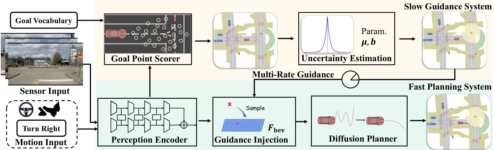
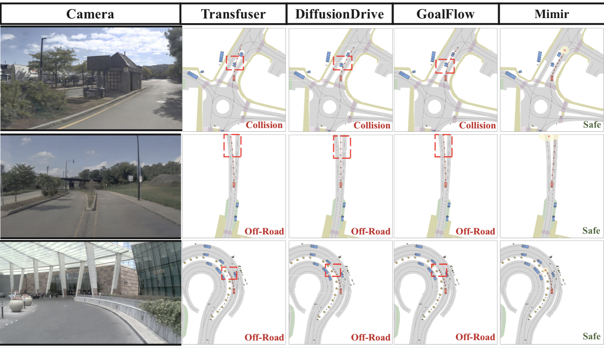
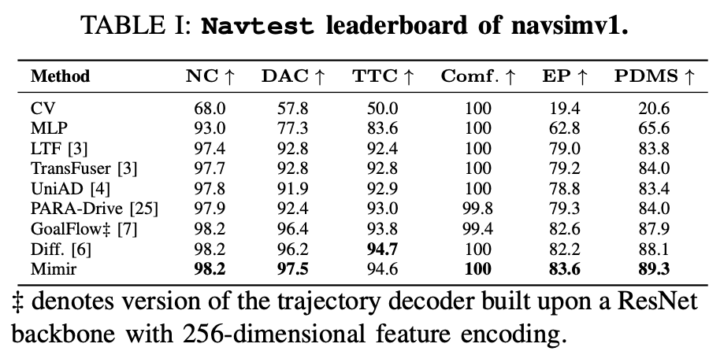
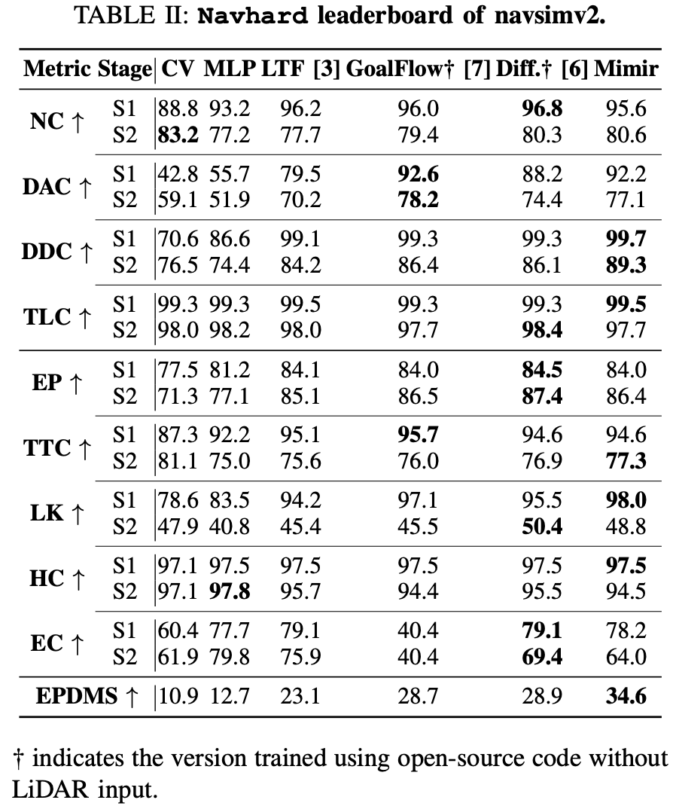

<br/>

> [**Mimir: Hierarchical Goal-Driven Diffusion with Uncertainty
Propagation for End-to-End Autonomous Driving**](https://arxiv.org/pdf/2512.07130)  <br>
> [Zebin Xing]()<sup>1*</sup>, [Yupeng Zheng]()<sup>1</sup>, [Qichao Zhang]()<sup>1</sup>, [Zhixing Ding]()<sup>1,2</sup>, [Pengxuan Yang]()<sup>1</sup>, [Songen Gu]()<sup>3</sup>, [Zhongpu Xia]()<sup>1</sup>, [Dongbin Zhao]()<sup>1</sup>  <br>
> <sup>1</sup> Institue of Automation, Chinese Academy of Sciences, <sup>2</sup> China University of Geosciences, <sup>3</sup> Fudan University  <br>
> <br>
> IEEE Robotics and Automation Letters (RAL), 2025 <br>
<div align="center">
    
</div>

>
**Mimir** is a hierarchical goal-driven diffusion model for end-to-end autonomous driving.
It improves upon **GoalFlow** by explicitly modeling goal uncertainty and accelerating goal inference, enabling more robust and efficient planning.
With a ResNet-34 backbone, Mimir achieves 89.3 PDMS and 34.6 EPDMS, demonstrating strong performance in both accuracy and efficiency.
<br/>
## News
* **`8 Dec, 2025`:**  We released our paper on [arXiv](https://arxiv.org/pdf/2512.07130). Code is coming soon.
* **`17 Nov, 2025`:**  Mimir was accepted at [RAL](https://ieeexplore.ieee.org/document/11282450) !
## To Do
- \[ ] Code for training
- \[ ] Code for validation, Weight of model
- \[x] Initial repo & main paper
<br/>
## Introduction
> End-to-end autonomous driving has shown strong potential with the aid of high-level guidance, yet its performance is often limited by inaccurate guidance and high computational cost.
To address these issues, we propose Mimir, a hierarchical dual-system framework that generates robust trajectories with uncertainty-aware goal modeling. Specifically, Mimir models goal uncertainty using a Laplace distribution to improve robustness and introduces a multi-rate guidance mechanism to accelerate high-level inference by predicting extended goal points in advance.
Experiments on the challenging Navhard and Navtest benchmarks show that Mimir outperforms prior methods by 20% in EPDMS, while achieving 1.6× faster inference for the high-level module without sacrificing accuracy. Code and models will be released to facilitate future research.


<div align="center">

</div>

## Visualization

### Comparison with Other Methods
The red cross ❌ represents the predicted goal point and the size of the yellow area around the goal point represents the level of uncertainty. Mimir leverages uncertainty estimation to mitigate the effects of inaccurate high-level guidance, enabling the generation of safer trajectories.
<div align="center">
    
</div>


## Results
Planning results on the proposed **NAVSIM** **Navtest** and **NAVSIMv2 Navhard** benchmark. Please refer to the [paper](https://arxiv.org/pdf/2512.07130) for more details.
<div align="center">
    
</div>
<div align="center">
    
</div>


## Contact
If you have any questions or suggestions, please feel free to open an issue or contact us (xzebin@bupt.edu.cn).

## Acknowledgement
<p>Mimir is also greatly inspired by the following outstanding contributions to the open-source community:</p>
<ul>
    <a href="https://github.com/autonomousvision/navsim" target="_blank">NAVSIM</a> | <a href="https://github.com/autonomousvision/transfuser" target="_blank">TransFuser</a> | <a href="https://github.com/YvanYin/GoalFlow" target="_blank">GoalFLow</a> | <a href="https://github.com/hustvl/DiffusionDrive" target="_blank">DiffusionDrive</a>
</ul>


## Citation
If you find Mimir useful, please consider giving us a star &#127775; and citing our paper with the following BibTeX entry.

```BibTeX
@ARTICLE{11282450,
  author={Xing, Zebin and Zheng, Yupeng and Zhang, Qichao and Ding, Zhixing and Yang, Pengxuan and Gu, Songen and Xia, Zhongpu and Zhao, Dongbin},
  journal={IEEE Robotics and Automation Letters}, 
  title={Mimir: Hierarchical Goal-Driven Diffusion with Uncertainty Propagation for End-to-End Autonomous Driving}, 
  year={2025},
  volume={},
  number={},
  pages={1-8},
  keywords={Uncertainty;Trajectory;Predictive models;Autonomous vehicles;Laser radar;Vocabulary;Planning;Feature extraction;Estimation;Artificial intelligence;Learning from Demonstration;Imitation Learning;Autonomous Vehicle Navigation},
  doi={10.1109/LRA.2025.3641129}}

```

<p align="right">(<a href="#top">back to top</a>)</p>
