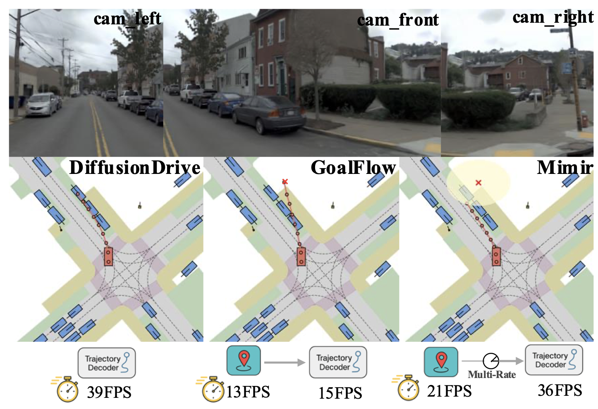
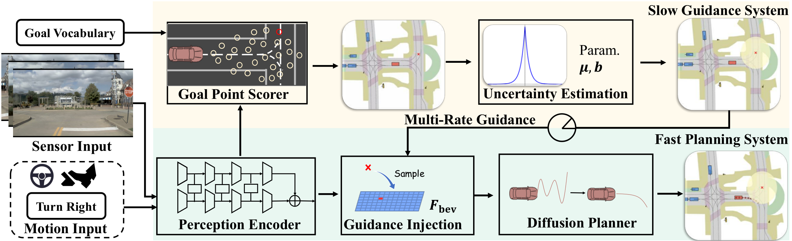
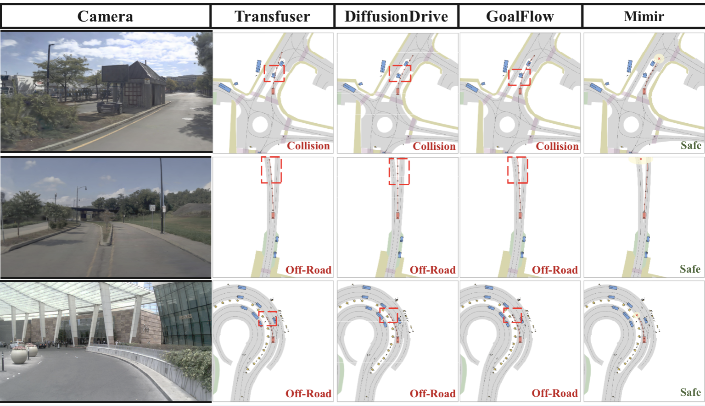
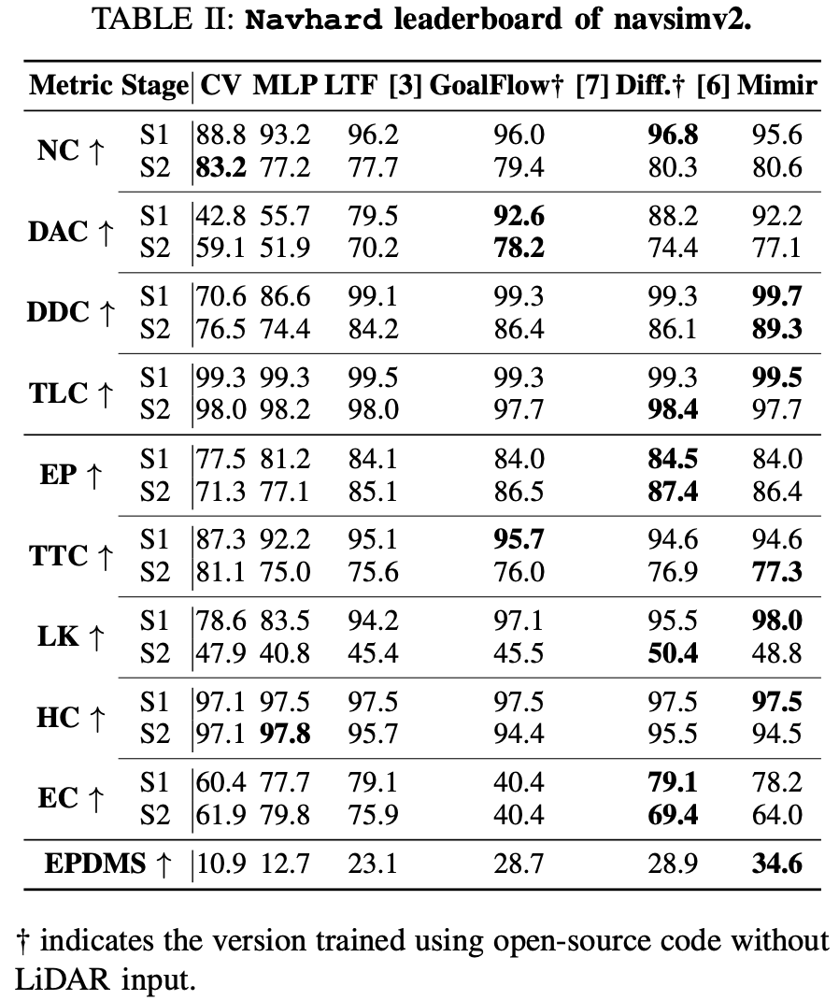
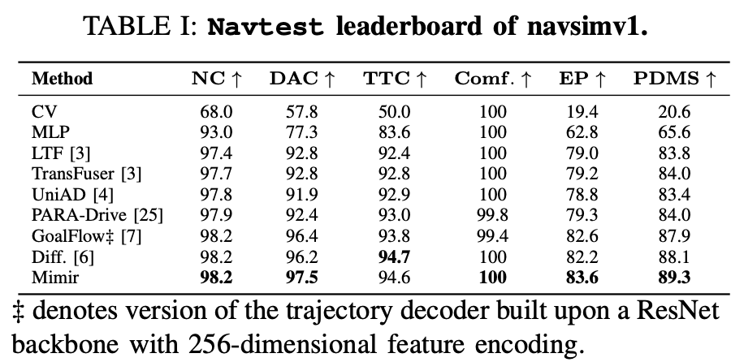

<br/>

> [**Mimir: Hierarchical Goal-Driven Diffusion with Uncertainty
Propagation for End-to-End Autonomous Driving**](https://arxiv.org/pdf/2512.07130)  <br>
> [Zebin Xing](https://zebinx.github.io/)<sup>1*</sup>, [Yupeng Zheng](https://scholar.google.com/citations?user=anGhGdYAAAAJ&hl=zh-CN&oi=ao)<sup>1</sup>, [Qichao Zhang](https://scholar.google.com/citations?user=snkECPAAAAAJ&hl=zh-CN)<sup>1</sup>, [Zhixing Ding]()<sup>1,2</sup>, [Pengxuan Yang](https://scholar.google.com/citations?user=cJFknzUAAAAJ&hl=zh-CNß)<sup>1</sup>, [Songen Gu](https://scholar.google.com/citations?user=W-msX90AAAAJ&hl=zh-CN)<sup>3</sup>, [Zhongpu Xia]()<sup>1</sup>, [Dongbin Zhao](https://scholar.google.com/citations?user=RxvYlNQAAAAJ&hl=zh-CN)<sup>1</sup>  <br>
> <sup>1</sup> Institue of Automation, Chinese Academy of Sciences, <sup>2</sup> China University of Geosciences, <sup>3</sup> Fudan University  <br>
> <br>
> IEEE Robotics and Automation Letters (RAL), 2025 <br>
<div align="center">
    
</div>

>
**Mimir** is a hierarchical goal-driven diffusion model for end-to-end autonomous driving.
It improves upon **GoalFlow** by explicitly modeling goal uncertainty and accelerating goal inference, enabling more robust and efficient planning.
With a ResNet-34 backbone, Mimir achieves 89.3 PDMS and 34.6 EPDMS, demonstrating strong performance in both accuracy and efficiency.
<br/>
## News
* **`26 Apr, 2026`:**  We released the code on navtest.
* **`8 Dec, 2025`:**  We released our paper on [arXiv](https://arxiv.org/pdf/2512.07130). Code is coming soon.
* **`17 Nov, 2025`:**  Mimir was accepted at [RAL](https://ieeexplore.ieee.org/document/11282450) !
## To Do
- \[x] Code for training
- \[x] Code for validation, Weight of model
- \[x] Initial repo & main paper
<br/>
## Introduction
> End-to-end autonomous driving has shown strong potential with the aid of high-level guidance, yet its performance is often limited by inaccurate guidance and high computational cost.
To address these issues, we propose Mimir, a hierarchical dual-system framework that generates robust trajectories with uncertainty-aware goal modeling. Specifically, Mimir models goal uncertainty using a Laplace distribution to improve robustness and introduces a multi-rate guidance mechanism to accelerate high-level inference by predicting extended goal points in advance.
Experiments on the challenging Navhard and Navtest benchmarks show that Mimir outperforms prior methods by 20% in EPDMS, while achieving 1.6× faster inference for the high-level module without sacrificing accuracy. Code and models will be released to facilitate future research.


<div align="center">

</div>

## Getting Started

We provide essential model weights and intermediate files (e.g., navigation points and uncertainty information). Mimir employs two separate models to generate uncertain navigation information and planning trajectories respectively.

### 📦 Model Zoo

| Agent | Size | Link | Description |
|:---|:---:|:---:|:---|
| **mimir_unc** | 724MB | [Download](https://huggingface.co/XXXXing/Mimir-Uncertainty-Driving/blob/main/ckpts/mimir_unc_epoch99.ckpt) | Generates navigation points with uncertainty modeling |
| **mimir** | 746MB | [Download](https://huggingface.co/XXXXing/Mimir-Uncertainty-Driving/blob/main/ckpts/mimir_epoch94.ckpt) | Plans trajectories based on uncertain navigation information |

### 📋 Data Preparation

Before proceeding, please complete the following prerequisites:

1. **Download NAVSIM Dataset** - Follow the [NAVSIM installation guide](https://github.com/autonomousvision/navsim/blob/main/docs/install.md) to download the [OpenScene dataset](https://huggingface.co/datasets/OpenDriveLab/OpenScene) and nuPlan maps
2. **Generate Metric Cache** - Create evaluation cache containing necessary metrics
3. **Generate Feature Cache** - Prepare training features for model training

### 📊 Evaluation

The evaluation process requires the Metric Cache generated in the Data Preparation step, which stores essential evaluation information.

Our evaluation pipeline consists of two stages:

**Step 1:** Generate navigation points and uncertainty information
```bash
bash scripts/run_generate_mimir_unc.sh
```

**Step 2:** Generate trajectories and evaluate performance
```bash
bash scripts/evaluation/run_mimir.sh
```

### 🎓 Training

We employ a two-stage training strategy to train `mimir_unc` and `mimir` agents separately:

1. **Train mimir_unc** (uses GoalFlow predicted goal points as initialization)
   ```bash
   bash scripts/training/run_mimir_unc_training.sh
   ```

2. **Generate navigation and uncertainty data** for training set
   ```bash
   bash scripts/run_generate_mimir.sh
   ```

3. **Train mimir agent** with generated navigation information
   ```bash
   bash scripts/training/run_mimir_training.sh
   ```

### ⚡ Asynchronous Inference

> 💡 **Note:** Intermediate navigation and uncertainty data are already provided. You can skip any stage and start development directly.

**Cross-Benchmark Compatibility:**
- Both `navhard` and `navtest` benchmarks use identical models for testing
- For `navhard` testing, you can directly use NAVSIM v2.x development library
- Simply migrate the contents from `navsim/agents/mimir/` and `navsim/planning/script/config/common/agent/mimir_agent*.yaml` for development

## Visualization

### Comparison with Other Methods
The red cross ❌ represents the predicted goal point and the size of the yellow area around the goal point represents the level of uncertainty. Mimir leverages uncertainty estimation to mitigate the effects of inaccurate high-level guidance, enabling the generation of safer trajectories.
<div align="center">
    
</div>

## Results
Planning results on the proposed **NAVSIM** **Navtest** and **NAVSIMv2 Navhard** benchmark. Please refer to the [paper](https://arxiv.org/pdf/2512.07130) for more details.
<table align="center">
  <tr>
    <td valign="top">
      
    </td>
    <td valign="top">
      
    </td>
  </tr>
</table>

## Contact
If you have any questions or suggestions, please feel free to open an issue or contact us (xzebin@bupt.edu.cn).

## Acknowledgement

Mimir is greatly inspired by the following outstanding contributions to the open-source community:

- 🌊 **[GoalFlow](https://github.com/)** - Goal point generation and flow-based prediction
- 🚗 **[DiffusionDrive](https://github.com/hustvl/DiffusionDrive)** - Diffusion-based trajectory planning framework
- 🗺️ **[NAVSIM](https://github.com/autonomousvision/navsim)** - Simulation platform and benchmark

We sincerely thank all contributors for their valuable work that helped shape this research.


## Citation
If you find Mimir useful, please consider giving us a star &#127775; and citing our paper with the following BibTeX entry.

```BibTeX
@ARTICLE{11282450,
  author={Xing, Zebin and Zheng, Yupeng and Zhang, Qichao and Ding, Zhixing and Yang, Pengxuan and Gu, Songen and Xia, Zhongpu and Zhao, Dongbin},
  journal={IEEE Robotics and Automation Letters}, 
  title={Mimir: Hierarchical Goal-Driven Diffusion With Uncertainty Propagation for End-to-End Autonomous Driving}, 
  year={2026},
  volume={11},
  number={2},
  pages={2178-2185},
  keywords={Uncertainty;Trajectory;Predictive models;Autonomous vehicles;Laser radar;Vocabulary;Planning;Feature extraction;Estimation;Artificial intelligence;Learning from demonstration;imitation learning;autonomous vehicle navigation},
  doi={10.1109/LRA.2025.3641129}}
```

<p align="right">(<a href="#top">back to top</a>)</p>
